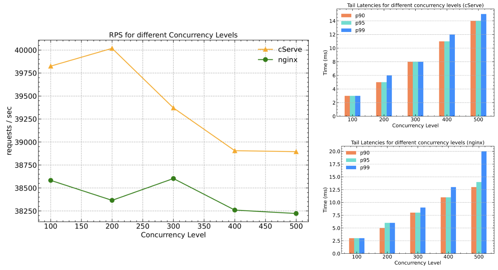

<p align="center">
<span style="font-size:100px">cServe</span>
</p>

<hr/>

A minimal yet capable multithreaded HTTP server that can be used for serving static pages on internet. cServe is written from scratch in C language and uses minimal dependencies. cServe uses multithreading to handle many concurrent connections efficiently.

## Compiling from Source

You need to have `gcc` and `make` installed on your system before you compile the code.

To compile the code, type the following command in terminal

```bash
make clean && make
```

This will compile all the source code and create a shared library `libcserve.so` in project directory.

## Start cServe Server

To use cServe in your code, include the header file `server.h`.

Compile your code using the command given below

```bash
gcc -O2 -I include/ main.c -o server -lcserve -L ./
```

Here I am using `main.c` as example to demonstrate usage of cServe. `-I` should provide the path to the header files of cServe. Update the value of `-I` if you are compiling from outside the project directory. `-L` provides the path to `libcserve.so`. Update this path accordingly if you are compiling from outside the project directory.

Once compiled, the server can be started by simply `./server` command.

## cServe Documentation

Please refer to [Documentation](./doc/documentation.md) for more details on how to use cServe to serve static content.

## Sample Code

For testing purposes, I'm using a sample website from [static-website-example](https://github.com/cloudacademy/static-website-example). Kindly clone the website from their repository and put it in cServe's project directory.

Optionally, to test out the custom function, you can create a `bio.html` file and write about yourself. When we make get request to `/about` route, the custom function will retreive `bio.html` file and display it in browser.

main.c

```C
#include <stdio.h>
#include <string.h>
#include "files.h"
#include "mime.h"
#include "server.h"

void custom_fn(void *server, int new_socket_fd, const char *path, void *args)
{
    http_server *s = (http_server *)server;
    char filepath[4096];
    sprintf(filepath, "%s/bio.html", path);
    file_data *filedata = file_load(filepath);
    char *mime_type = mime_type_get(filepath);
    if (filedata != NULL && mime_type != NULL)
    {
        send_http_response(
            server, new_socket_fd, HEADER_OK, mime_type, filedata->data, filedata->size);
    }
    else
    {
        char body[] = "Resource not Found!";
        send_http_response(server, new_socket_fd, HEADER_404, "text/html", body, strlen(body));
    }
}

int main()
{
    size_t method_len = 1;
    char *methods[1] = {"GET"};
    http_server *server = create_server(8080, 0, 0, "static-website-example", 0, 0, 1000);
    server_route(server, "/", "index.html", methods, method_len, NULL, NULL, NULL);
    server_route(server, "/about", NULL, methods, method_len, NULL, custom_fn, NULL);
    printf("Starting server\n");
    server_start(server, 1, 1);
    return 0;
}
```

Compile and run using the following command

```bash
gcc -O2 -I include/ main.c -o server -lcserve -L ./
```

Assumes that you are in the project directory, where include/ is the path to header files of cServe and `-L ./` provides the path to `libcserve.so` file.

To run the server,

```bash
./server
```

```console
server listening on port 8082...
Added Route - / with value index.html
Added Route - /about with value (null)
Starting server
Number of Queues : 6
Number of Complete Blocks : 6
Padded Block Dim : 0
Block Dim : 2
Grid Dim : 12
```

## Performance Comparisons with NGINX

This work is no competitor to NGINX. NGINX just serves as a reference point for comparing performance of cServe and to validate cServe’s capabilities of handling concurrent connections.

#### Running Apache Benchmark test on cServe.

Concurrency Level = 500 | Total Requests = 1M

```console
This is ApacheBench, Version 2.3 <$Revision: 1879490 $>
Copyright 1996 Adam Twiss, Zeus Technology Ltd, http://www.zeustech.net/
Licensed to The Apache Software Foundation, http://www.apache.org/

Benchmarking localhost (be patient)
Completed 100000 requests
Completed 200000 requests
Completed 300000 requests
Completed 400000 requests
Completed 500000 requests
Completed 600000 requests
Completed 700000 requests
Completed 800000 requests
Completed 900000 requests
Completed 1000000 requests
Finished 1000000 requests


Server Software:
Server Hostname:        localhost
Server Port:            8082

Document Path:          /
Document Length:        Variable

Concurrency Level:      500
Time taken for tests:   25.963 seconds
Complete requests:      1000000
Failed requests:        0
Total transferred:      14910000000 bytes
HTML transferred:       13322001507 bytes
Requests per second:    38516.76 [#/sec] (mean)
Time per request:       12.981 [ms] (mean)
Time per request:       0.026 [ms] (mean, across all concurrent requests)
Transfer rate:          560825.13 [Kbytes/sec] received

Connection Times (ms)
              min  mean[+/-sd] median   max
Connect:        0    6   1.6      6      15
Processing:     4    7   1.6      7      16
Waiting:        0    2   0.7      2       5
Total:          8   13   0.6     13      23

Percentage of the requests served within a certain time (ms)
  50%     13
  66%     13
  75%     13
  80%     13
  90%     14
  95%     14
  98%     14
  99%     15
 100%     23 (longest request)
```

#### Running Apache Benchmark test on NGINX.

NGINX server was configured to match the capabilities of cServe to keep fair comparisons. This involves, disabling multi workers, disabling TLS/SSL, disabling gzip, sendfile() and much more.

Concurrency Level = 500 | Total Requests = 1M

```console
This is ApacheBench, Version 2.3 <$Revision: 1879490 $>
Copyright 1996 Adam Twiss, Zeus Technology Ltd, http://www.zeustech.net/
Licensed to The Apache Software Foundation, http://www.apache.org/

Benchmarking localhost (be patient)
Completed 100000 requests
Completed 200000 requests
Completed 300000 requests
Completed 400000 requests
Completed 500000 requests
Completed 600000 requests
Completed 700000 requests
Completed 800000 requests
Completed 900000 requests
Completed 1000000 requests
Finished 1000000 requests


Server Software:        nginx/1.18.0
Server Hostname:        localhost
Server Port:            8080

Document Path:          /
Document Length:        Variable

Concurrency Level:      500
Time taken for tests:   26.163 seconds
Complete requests:      1000000
Failed requests:        0
Total transferred:      15074000000 bytes
HTML transferred:       14829000000 bytes
Requests per second:    38222.29 [#/sec] (mean)
Time per request:       13.081 [ms] (mean)
Time per request:       0.026 [ms] (mean, across all concurrent requests)
Transfer rate:          562658.97 [Kbytes/sec] received

Connection Times (ms)
              min  mean[+/-sd] median   max
Connect:        0    4   1.4      4       8
Processing:     3   10   1.5      9      17
Waiting:        0    6   2.6      5      17
Total:          6   13   1.0     13      22

Percentage of the requests served within a certain time (ms)
  50%     13
  66%     13
  75%     13
  80%     13
  90%     13
  95%     14
  98%     14
  99%     20
 100%     22 (longest request)
```

From the above benchmarks, performance of cServe is pretty comparable to NGINX.

#### Comparing performance across multiple concurrency levels

The figure below shows comparison of cServe and NGINX server for multiple concurrency levels.

<p align="center">
</img>
</p>

## Caution

This work is not meant to be used in any production setting for serving static content. There are no security features built into cServe. This makes your website and data to be vulnerable to attacks. This work is done purely out of my interest in figuring out how HTTP servers work under the hood. That said, I believe this project helps people understand working of HTTP servers and how to go about building scalable servers from scratch.

## Contributions

If you like this library and would like to make it better, you are free to do so. It takes a team effort to make things better. Hence I would love to have you on board.

Avoid making commits directly to main branch. Create your own branch and make a pull request. After your pull request is approved, the changes you have made would be merged with the main code.

## License

MIT
